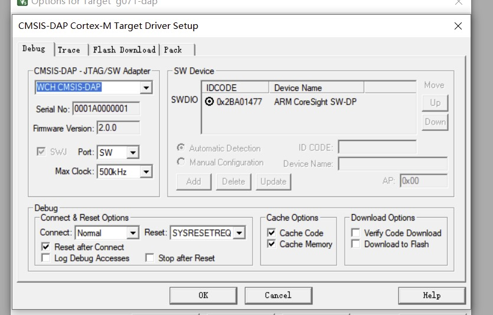
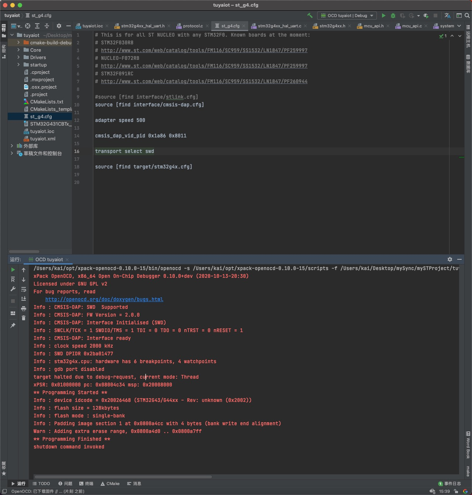

Maybe it is the cheapest cmsis-dap debugger. 

[Official description](http://www.wch.cn/products/WCH-Link.html?from=search&wd=eyJpdiI6IjMyRDc0Z2dCV2g2UkVINldPaUtHWXc9PSIsInZhbHVlIjoiWndXN2d5OFhMUkt2UGZQZnF1Z1lcL0E9PSIsIm1hYyI6ImNkMDcwNzQ0YmNjOGZkNjkxN2IwZGFlNjY3ZDhmYTA3MmZjNDZmNTg0OTQ4MjM4ZWIwZTYzODAyY2Y5NDMxOWIifQ==)

[Official schematic and mannual](http://www.wch.cn/bbs/thread-71088-1.html)
# Hardward
The main MCU is CH549F, which has a lot of advantages.
* cheap. The MCU is a 8051 core, and the price is less than 5RMB. It is cheaper than CH32F103 to make a CMSIS-DAP debugger.
* easy to soldering. The MCU is an SOP-16 package. 
* can also be small. The CH549 also have a QFN28 package. 
* can debug both ARM and RISC-V core MCU. (The target MCU should support SWD)

# Firmware
The firmware is extract from MounRiver Studio.

# Screenshot
MDK-ARM

openocd

size

# How to Flash
* short connect the 1.27mm pin hole
* plug in the type-c connector
* open the WCHISPTool.(The installer is in "tools" folder)
* choose the 8-bit CH54X series, set the MCU model to CH549, set the download way to USB, select the erase the DataFlash, choose the right USB device and the user program file(use WCHLINK_V1.2.bin)
* click the flash button.
* if all goes well, you will see the success count adding one. You can plug off and plug in the DIY WCH-Link. If the 2 LEDs are all on, plug off it and short connect the TX and GND and plug in.

# How to Use
* When using MDK-ARM, it can be use as a normal CMSIS-DAP debugger. However, when using openocd to drive the WCH-Link, you should define the vid and pid by using the code 
  
  `cmsis_dap_vid_pid 0x1a86 0x8011`
  
  In command line, the code should be before "-c" parameter. while in .cfg file, it should be added as above picture.

for more information, check the documents in "documents" folder.